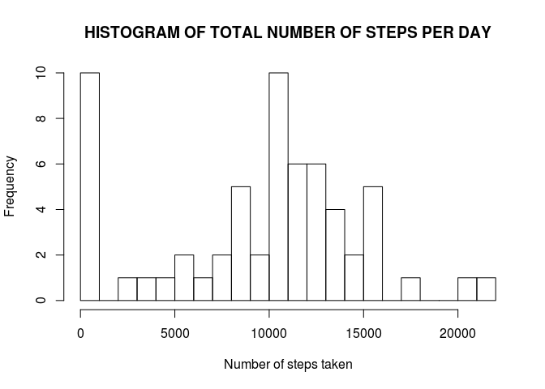
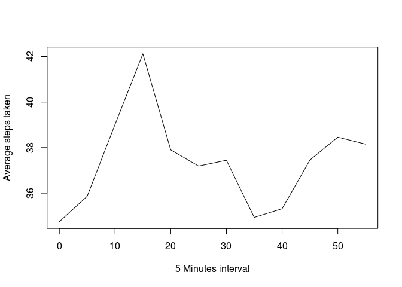
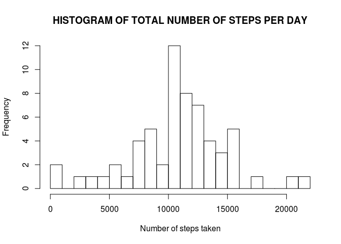
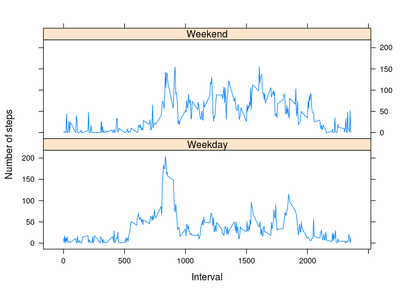

## Loading and preprocessing the data


```r
## Download the raw data
datadir <- "./datadir/"
zipfilename <- "./datadir/repdata_data_activity.zip"
filename <- "./datadir/activity.csv"
if (!file.exists(zipfilename)){
        dataUrl <- "https://d396qusza40orc.cloudfront.net/repdata%2Fdata%2Factivity.zip"
        download.file(dataUrl, zipfilename, method="curl")
}  
## Extract data files.
        unzip(zipfile=zipfilename, exdir = datadir)
## Read data from csv file.
        raw_data <- read.csv(filename, stringsAsFactors = TRUE)
## Clean data, remove NA values from dataset.
        clean_data <- raw_data[complete.cases(raw_data),]
## Reorder colums to satisfy my personal taste.
        clean_data <- clean_data[c(2, 3, 1)]
```

## What is mean total number of steps taken per day?
For this part of the assignment, you can ignore the missing values in the dataset.

1. Calculate the total number of steps taken per day.


```r
## Compute the total number of steps per day.
        total_steps_per_day <- tapply(clean_data$steps, clean_data$date, 
                                      FUN = sum, na.rm = TRUE, default = 0, 
                                      simplify = TRUE)
## Creat a dataset with the sumarized data.
        total_steps_per_day_df <- as.data.frame(total_steps_per_day)
        total_steps_per_day_df <- cbind(rownames(total_steps_per_day_df), 
                                        total_steps_per_day_df )
        colnames(total_steps_per_day_df)<- c("date","num_steps")
## Print an example of the summarized data.
        head(total_steps_per_day_df)
```

```
##                  date num_steps
## 2012-10-01 2012-10-01         0
## 2012-10-02 2012-10-02       126
## 2012-10-03 2012-10-03     11352
## 2012-10-04 2012-10-04     12116
## 2012-10-05 2012-10-05     13294
## 2012-10-06 2012-10-06     15420
```

2. If you do not understand the difference between a histogram and a 
barplot, research the difference between them. Make a histogram of the
total number of steps taken each day.


```r
## Plot the histogram of total number of steps taken per day.
        hist(total_steps_per_day_df$num_steps, main = "HISTOGRAM OF TOTAL NUMBER OF STEPS PER DAY", 
        breaks = 20, xlab ="Number of steps taken", ylab= "Frequency")
```

<!-- -->
        
3. Calculate and report the mean and median of the total number of steps 
taken per day


```r
## Compute and print the mean and median of total number of steps taken per day.
        steps_per_day_summary1 <-c(mean(total_steps_per_day_df$num_steps), 
                                median(total_steps_per_day_df$num_steps))
        names(steps_per_day_summary1) <- c("Mean", "Median")
        head(steps_per_day_summary1)
```

```
##     Mean   Median 
##  9354.23 10395.00
```
   
## What is the average daily activity pattern?

1. Make a time series plot (i.e. type = "l"\color{red}{\verb|type = "l"|}type="l") of the 5-minute interval (x-axis) and the average number of steps taken, averaged across all days (y-axis)


```r
# Create a scratchpad dataset.
        tmp_data <- data.frame(clean_data)
## Create the time sequence of 5 minutes intervals.
        tmp_data$interval <- rep(seq(from = 0, to = 55, by= 5), nrow(clean_data)/12)
## Summarize the data, compute the mean per 5 minutes interval.
        steps_per_interval <- tapply(tmp_data$steps, tmp_data$interval, FUN = mean, 
                                     na.rm = TRUE, default = 0, simplify = TRUE)
## Creat a dataset with the summarized data.
        time_series_df <- as.data.frame(steps_per_interval)
        time_series_df <- cbind(seq(from = 0, to = 55, by= 5), time_series_df )
        colnames(time_series_df)<- c("interval","num_steps")
## Plot the mean of steps take along the 5 minutes inteval time series.
        plot(time_series_df, type = "l", xlab= "5 Minutes interval", 
             ylab= "Average steps taken")
```

<!-- -->

2. Which 5-minute interval, on average across all the days in the dataset, 
contains the maximum number of steps?

```r
## Compute and print the 5 minutes interval with the maximum number of steps
## taken.
    max_steps_interval <- time_series_df$interval[time_series_df$num_steps ==    max(time_series_df$num_steps)]
    print(paste0("5 minutes interval with more steps taken: ", max_steps_interval))
```

```
## [1] "5 minutes interval with more steps taken: 15"
```
## Imputing missing values

Note that there are a number of days/intervals where there are missing values
(coded as NA). The presence of missing days may introduce bias into some calculations 
or summaries of the data.

1. Calculate and report the total number of missing values in the dataset 
(i.e. the total number of rows with NAs).


```r
## Compute and print the number of records with NA values.
        missing_values <- sum(!complete.cases(raw_data))
        print(paste0("Number of missing values: ", missing_values))
```

```
## [1] "Number of missing values: 2304"
```

2. Devise a strategy for filling in all of the missing values in the dataset. 
The strategy does not need to be sophisticated. For example, you could use the 
mean/median for that day, or the mean for that 5-minute interval, etc.

The strategy devised is to replace the NA values with randomly sampled values from
a copy of the dataset where the NAs have been removed.


```r
## Randomly sample values from the clean dataset
        replacement_samples <- sample(x =clean_data$steps, 
        size = missing_values,
        replace = TRUE)
```

3. Create a new dataset that is equal to the original dataset but with the 
missing data filled in.


```r
## create a new dataset and replace the NA values with the randomly sampled ones.
        complete_data <- data.frame(raw_data)
        complete_data$steps[!complete.cases(raw_data)] <- replacement_samples
```

4. Make a histogram of the total number of steps taken each day and Calculate 
and report the mean and median total number of steps taken per day.


```r
## Summarize the number of steps taken per day.
        total_steps_per_day <- tapply(complete_data$steps, complete_data$date, FUN = sum, 
                                      na.rm = TRUE, default = 0, simplify = TRUE)

## Create a new data frame with the summarized information.
        total_steps_per_day_df <- as.data.frame(total_steps_per_day)
        total_steps_per_day_df <- cbind(rownames(total_steps_per_day_df), total_steps_per_day_df )
        colnames(total_steps_per_day_df)<- c("date","num_steps")
        
## Plot histogram of number of steps taken each day employing the dataset with
## complete values.
        hist(total_steps_per_day_df$num_steps, main = "HISTOGRAM OF TOTAL NUMBER OF STEPS PER DAY", 
            breaks = 20, xlab= "Number of steps taken", ylab= "Frequency")
```

<!-- -->

```r
## Compute the mean and mediaan of steps taken per day using the dataset with 
## complete values.
        steps_per_day_summary1 <-c(mean(total_steps_per_day_df$num_steps), 
                                   median(total_steps_per_day_df$num_steps))
        names(steps_per_day_summary1) <- c("mean","median")
        
## Print the computed mean and median values.
        head(steps_per_day_summary1)
```

```
##    mean  median 
## 10696.7 10752.0
```
Do these values differ from the estimates from the first part of the assignment? 

    * Yes the mean and median results differ slightly from the ones previously
    computed.

What is the impact of imputing missing data on the estimates of the total daily number of steps?

    * The resulting histogram of the values better resembles a normal distribution where
    the mean and the median values become closer.

## Are there differences in activity patterns between weekdays and weekends?

    * Yes, there are differenes, during the weekdays, there is more activity
    during the whole day. However, during weekends, most of the activity happens
    during the initial hours of the day.
    
Create a new factor variable in the dataset with two levels – “weekday” 
and “weekend” indicating whether a given date is a weekday or weekend day.


```r
complete_data$date <- as.Date(complete_data$date ) 
complete_data_day_type <- cbind(complete_data, day_type = sapply(X = complete_data$date, 
                                                        FUN = function(x){
                                                            day = weekdays(x, abbreviate=TRUE)
                                                            day
                                                            if ((day== "Sat") ||
                                                                (day == "Sun"))
                                                                day = "Weekend"
                                                            else
                                                                day = "Weekday"
                                                        }, 
                                                        simplify = TRUE))
```

Make a panel plot containing a time series plot (i.e. type = "l") of the 5-minute interval (x-axis) and the average number of steps taken, averaged across all weekday days or weekend days (y-axis). See the README file in the GitHub repository to see an example of what this plot should look like using simulated data.


```r
library(plyr)
library(lattice)

steps_summary <- ddply(complete_data_day_type, .(day_type,interval), summarize, 
                       mean_steps = mean(steps))

xyplot(mean_steps~interval|day_type, data = steps_summary, type = "l", 
       layout= c(1,2), xlab ="Interval", ylab = "Number of steps")
```

<!-- -->
